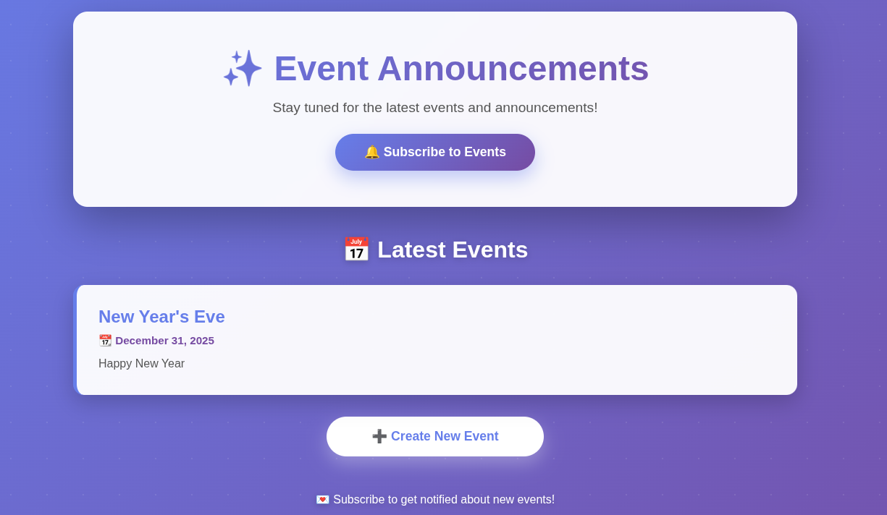
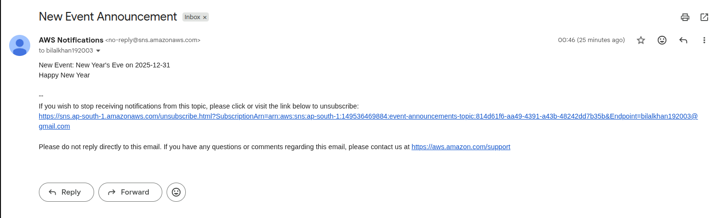

# 🎉 Event Announcement Platform

A serverless event management platform built on AWS that enables users to create, view, and subscribe to event announcements via email notifications.

## 📸 Project Overview


*Serverless architecture leveraging AWS services for scalable event management*


*Clean, intuitive interface for event discovery and subscription*


*ScreenShot, Of Notification*

## 🚀 Features

- **📧 Email Subscriptions**: Users can subscribe to receive instant notifications about new events
- **📅 Event Listing**: Dynamic display of all upcoming events fetched from S3
- **➕ Event Creation**: Simple form interface to create and announce new events
- **🔔 Real-time Notifications**: Automatic email alerts sent to all subscribers when new events are created
- **☁️ Fully Serverless**: No servers to manage, scales automatically with demand

## 🏗️ Architecture

This project implements a modern serverless architecture using:

1. **Amazon S3**: Hosts static website files (HTML, CSS, JS) and stores event data in `events.json`
2. **Amazon API Gateway**: Exposes RESTful endpoints for frontend-backend communication
3. **AWS Lambda**: Two functions handle core business logic:
   - **Subscription Lambda**: Adds new email subscribers to SNS topic
   - **Event Registration Lambda**: Updates events.json and triggers notifications
4. **Amazon SNS**: Manages email subscriptions and broadcasts event announcements
5. **IAM**: Implements least-privilege access policies for secure resource interaction

### Data Flow

```
User → S3 Static Website → API Gateway → Lambda Functions → S3/SNS → Email Notifications
```

## 🛠️ Technologies Used

- **Infrastructure as Code**: Terraform
- **Cloud Provider**: AWS
- **Frontend**: HTML5, CSS3, JavaScript
- **Backend**: AWS Lambda (Python)
- **API**: Amazon API Gateway (REST API)
- **Storage**: Amazon S3
- **Notifications**: Amazon SNS
- **Security**: AWS IAM

## 📁 Project Structure

```
event-announcement-platform/
├── terraform/
│   ├── main.tf              # Main infrastructure configuration
│   ├── backend.tf           # Remote Backend
│   └── provider.tf
├── frontend/
│   ├── index.html           # Main website
│   └── events.json          # Event data store
├── backend/
│   ├── publisher_function.py
│   └── subscriber_function.py
└── README.md
```

## 🔐 Security Features

- **IAM Roles**: Lambda functions use least-privilege IAM roles
- **API Gateway**: Secured endpoints with throttling and request validation
- **S3 Bucket Policies**: Controlled access to static assets and data files
- **SNS**: Email verification required for subscriptions

## 💰 Cost Optimization

This architecture is designed to be cost-effective:
- **S3**: Pay only for storage (pennies per month for small sites)
- **Lambda**: Free tier includes 1M requests/month
- **API Gateway**: Free tier includes 1M API calls/month
- **SNS**: First 1,000 email deliveries free per month

**Estimated monthly cost**: $0-5 for low to moderate traffic

## 📚 Learning Resources

This project was built as part of my cloud learning journey. Key concepts covered:

- Serverless architecture patterns
- Infrastructure as Code with Terraform
- AWS service integration
- Event-driven architecture

## 🤝 Contributing

Contributions are welcome! Please feel free to submit a Pull Request.

## 🙏 Acknowledgments

- Built as part of the "Zero to Cloud" learning program
- Inspired by serverless architecture

---

⭐ If you found this project helpful, please consider giving it a star!